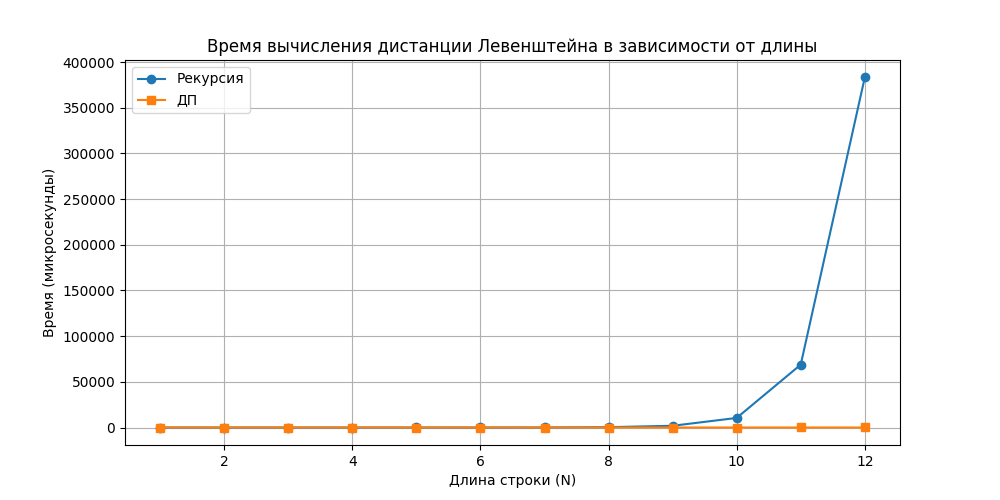
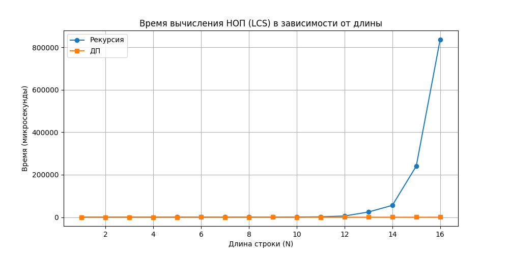

# Отчет по лабораторной работе №4: Динамическое программирование
### Вариант 9
---

## Задание 1 и 2.

### Исходный код (C++)
```cpp
#include <iostream>
#include <vector>
#include <string>
#include <algorithm>
#include <chrono>
#include <iomanip>

using namespace std;
using namespace std::chrono;

string generateRandomString(int length) {
    string str;
    str.reserve(length);
    for (int i = 0; i < length; ++i) {
        str += (char)('a' + rand() % 26);
    }
    return str;
}

int lev_recursive(const string& s1, int i, const string& s2, int j) {
    if (i == 0) return j;
    if (j == 0) return i;
    int cost = (s1[i - 1] == s2[j - 1]) ? 0 : 1;
    return min({
        lev_recursive(s1, i - 1, s2, j) + 1,
        lev_recursive(s1, i, s2, j - 1) + 1,
        lev_recursive(s1, i - 1, s2, j - 1) + cost
    });
}

int lev_dp(const string& s1, const string& s2) {
    int m = s1.length(), n = s2.length();
    vector<vector<int>> dp(m + 1, vector<int>(n + 1));
    for (int i = 0; i <= m; i++) dp[i][0] = i;
    for (int j = 0; j <= n; j++) dp[0][j] = j;
    
    for (int i = 1; i <= m; i++) {
        for (int j = 1; j <= n; j++) {
            int cost = (s1[i - 1] == s2[j - 1]) ? 0 : 1;
            dp[i][j] = min({
                dp[i - 1][j] + 1,
                dp[i][j - 1] + 1,
                dp[i - 1][j - 1] + cost
            });
        }
    }
    return dp[m][n];
}
```

**Результат:**
Дистанция Левенштейна: **238**.
Время вычисления методом ДП: **~208 мкс**.

---

## Задание 3

| Длина подстроки (N) | Рекурсия (мкс) | ДП (мкс) |
| :--- | :--- | :--- |
| 1 | 0 | 0 |
| 2 | 0 | 0 |
| 3 | 0 | 0 |
| 4 | 0 | 0 |
| 5 | 2 | 0 |
| 6 | 12 | 0 |
| 7 | 63 | 0 |
| 8 | 343 | 0 |
| 9 | 1885 | 0 |
| 10 | 10560 | 0 |
| 11 | 63793 | 3 |
| 12 | 377343 | 7 |



---

## Задание 4

**Строки:** `гора` и `вор`.

```bash
1. d('гора', 'вор') = min{d('гор', 'вор') + 1; d('гора', 'во') + 1; d('гор', 'во') + 1} = min{1 + 1; 3 + 1; 2 + 1} = 2
2. d('гор', 'вор') = min{d('го', 'вор') + 1; d('гор', 'во') + 1; d('го', 'во') + 0} = min{2 + 1; 2 + 1; 1 + 0} = 1
3. d('го', 'вор') = min{d('г', 'вор') + 1; d('го', 'во') + 1; d('г', 'во') + 1} = min{3 + 1; 1 + 1; 2 + 1} = 2
4. d('г', 'вор') = min{d('', 'вор') + 1; d('г', 'во') + 1; d('', 'во') + 1} = min{3 + 1; 2 + 1; 2 + 1} = 3
5. d('гора', 'во') = min{d('гор', 'во') + 1; d('гора', 'в') + 1; d('гор', 'в') + 1} = min{2 + 1; 4 + 1; 3 + 1} = 3
6. d('гор', 'во') = min{d('го', 'во') + 1; d('гор', 'в') + 1; d('го', 'в') + 1} = min{1 + 1; 3 + 1; 2 + 1} = 2
7. d('го', 'во') = min{d('г', 'во') + 1; d('го', 'в') + 1; d('г', 'в') + 0} = min{2 + 1; 2 + 1; 1 + 0} = 1
8. d('г', 'во') = min{d('', 'во') + 1; d('г', 'в') + 1; d('', 'в') + 1} = min{2 + 1; 1 + 1; 1 + 1} = 2
9. d('гора', 'в') = min{d('гор', 'в') + 1; d('гора', '') + 1; d('гор', '') + 1} = min{3 + 1; 4 + 1; 3 + 1} = 4
10. d('гор', 'в') = min{d('го', 'в') + 1; d('гор', '') + 1; d('го', '') + 1} = min{2 + 1; 3 + 1; 2 + 1} = 3
11. d('го', 'в') = min{d('г', 'в') + 1; d('го', '') + 1; d('г', '') + 1} = min{1 + 1; 2 + 1; 1 + 1} = 2
12. d('г', 'в') = min{d('', 'в') + 1; d('г', '') + 1; d('', '') + 1} = min{1 + 1; 1 + 1; 0 + 1} = 1
13. d('', '')=0; d('г', '')=1; d('го', '')=2; d('гор', '')=3; d('гора', '')=4; d('', 'в')=1; d('', 'во')=2; d('', 'вор')=3
```
Чтобы превратить «гора» в «вор»:
1. Заменяем «г» на «в» -> «вора» (1 операция).
2. Символ «о» совпадает (0 операций).
3. Символ «р» совпадает (0 операций).
4. Удаляем «а» -> «вор» (1 операция).
Итого 2 операции.

---

## Задание 5
**Строки:** `S1 = ABHCSUV` и `S2 = KIBOSV`

```cpp
int lcs_recursive(const string& s1, int i, const string& s2, int j) {
    if (i == 0 || j == 0) return 0;
    if (s1[i - 1] == s2[j - 1]) {
        return 1 + lcs_recursive(s1, i - 1, s2, j - 1);
    }
    return max(lcs_recursive(s1, i - 1, s2, j), lcs_recursive(s1, i, s2, j - 1));
}

int lcs_dp(const string& s1, const string& s2) {
    int m = s1.length(), n = s2.length();
    vector<vector<int>> dp(m + 1, vector<int>(n + 1, 0));
    
    for (int i = 1; i <= m; i++) {
        for (int j = 1; j <= n; j++) {
            if (s1[i - 1] == s2[j - 1]) {
                dp[i][j] = dp[i - 1][j - 1] + 1;
            } else {
                dp[i][j] = max(dp[i - 1][j], dp[i][j - 1]);
            }
        }
    }
    return dp[m][n];
}
```

### Ход решения ДП
Размер матрицы $8 \times 7$

|   | ∅ | K | I | B | O | S | V |
|---|---|---|---|---|---|---|---|
| **∅** | 0 | 0 | 0 | 0 | 0 | 0 | 0 |
| **A** | 0 | 0 | 0 | 0 | 0 | 0 | 0 |
| **B** | 0 | 0 | 0 | **1** | 1 | 1 | 1 |
| **H** | 0 | 0 | 0 | 1 | 1 | 1 | 1 |
| **C** | 0 | 0 | 0 | 1 | 1 | 1 | 1 |
| **S** | 0 | 0 | 0 | 1 | 1 | **2** | 2 |
| **U** | 0 | 0 | 0 | 1 | 1 | 2 | 2 |
| **V** | 0 | 0 | 0 | 1 | 1 | 2 | **3** |

**Обратный ход:**
Начинаем с правого нижнего угла матрицы `L[7][6]`:
1. `X[6] ('V') == Y[5] ('V')` -> Записываем **V** в ответ. Идем по диагонали в `(6, 5)`.
2. В `L[6][5]` (буквы U и S). Они не равны. Проверяем соседей: `L[5][5] (2) > L[6][4] (1)`. Идем вверх в `(5, 5)`.
3. `X[5] ('S') == Y[4] ('S')` -> Записываем **S**. Идем по диагонали в `(4, 4)`.
4. В `L[4][4]` (буквы C и O). Не равны. `L[3][4] (1) <= L[4][3] (1)`. Идем влево в `(4, 3)`.
5. В `L[4][3]` (буквы C и B). Не равны. `L[3][3] (1) > L[4][2] (0)`. Идем вверх в `(3, 3)`.
6. В `L[3][3]` (буквы H и B). Не равны. `L[2][3] (1) > L[3][2] (0)`. Идем вверх в `(2, 3)`.
7. `X[1] ('B') == Y[2] ('B')` -> Записываем **B**. Идем по диагонали в `(1, 2)`.
8. Доходим до нулей. 

Переворачиваем ответ, получаем: **BSV**. Длина = 3.

### Время выполнения

| Длина строк (N) | Рекурсия (мкс) | ДП (мкс) |
| :--- | :--- | :--- |
| 1-4 | 0 | 0 |
| 6 | 2 | 0 |
| 8 | 27 | 0 |
| 10 | 556 | 0 |
| 12 | 6033 | 2 |
| 14 | 46155 | 2 |
| 16 | 773213 | 5 |



